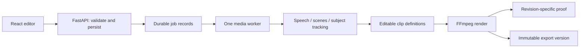

# Architecture and decisions

Clipflow is a React/Vite editor backed by FastAPI, a serialized media worker, and a persistent data directory. The browser edits clip definitions; it does not download speech models or encode the final video.

## Why retain Vite instead of migrating to Next.js?

The editor is an interactive client application with established playback and editing state. Server-rendered pages do not accelerate FFmpeg, tracking, or transcription. Vercel supports [Vite applications](https://vercel.com/docs/frameworks/frontend/vite), so changing the frontend framework would add migration risk without solving the processing problem. The FastAPI API remains the authority for projects, job state, credentials, and exports.

## Runtime boundary

Vercel hosts the built editor. A separate persistent container runs the API and CPU worker. Requests enqueue work and return job IDs; the UI polls progress and can request cancellation. One worker keeps memory/CPU use predictable and avoids competing renders on a small machine. Run **one Uvicorn process and one replica per workspace**. This is not a distributed queue.

[Vercel Functions](https://vercel.com/docs/functions/limitations) have bounded duration, memory, payload and bundle sizes. [Supabase Edge Functions](https://supabase.com/docs/guides/functions/limits) have a 256 MB memory limit and a two-second CPU budget per request. Neither is an appropriate default host for local Whisper and long FFmpeg processing. An external rewrite is an API transport, not a replacement for the worker. Long video uploads must be tested against the chosen proxy and worker limits.

## Data flow

`store.py` owns atomic JSON metadata, additive schema migration and last-valid backups. `app.py` coordinates HTTP operations and background jobs. `media.py` handles probing, scene/silence analysis, tracking, crop geometry and FFmpeg. `transcription.py` owns speech options and local/Groq providers. `highlights.py` ranks candidate passages separately from complete-source segmentation. `export_artifacts.py` keeps job-specific output paths. `settings.py` keeps provider credentials server-side. `hosting.py` supplies the optional hosted access boundary.

The data directory separates `projects/*.json`, `jobs.json`, original media under `files/`, render proofs, and immutable `files/<project>/exports/<job>/` artifacts. Browser state remembers the working project and selection; project edits and finished jobs remain on the server after refresh. Interrupted jobs become visible retryable errors after restart rather than silently rerunning paid requests.

## Supabase evaluation

Supabase Auth provides an identity service for an optional private hosted workspace. The first hosted adapter admits exactly one configured owner. Other Supabase users cannot access the workspace, including its settings or media. This is **not a multi-user SaaS deployment**. Multiple workspaces require separate isolated backend/data deployments until tenant-scoped storage and job registries are implemented.

Supabase Postgres/Storage would benefit distributed workers and collaboration. They are not introduced as a second source of truth for this single-worker release. A later migration should move metadata transactionally, apply row-level security, use private object buckets and signed URLs, and use [resumable uploads](https://supabase.com/docs/guides/storage/uploads/standard-uploads) for large files. Local users never need a Supabase account.

## Editing and consistency

Clips store their source range, caption positioning, framing, audio options and revision. Reviewed and suggestion decisions describe workflow, independently from which clip is active or checked for export. Render jobs use a snapshot; a completed export cannot mark a newer edit as exported. Complete segmentation checks for concurrent edits before replacing clip definitions. Regenerating highlights preserves edited or kept clips.

Source playback is a fast editing approximation. FFmpeg render proofs use the export path and must be used to judge tracking, noise reduction, fades, amplified audio and final caption appearance. The interface labels this distinction.

## Models, secrets and limits

The free path uses FFmpeg, OpenCV, yt-dlp and faster-whisper. The Windows package includes the multilingual Small model for offline use. Source installs and other model choices download once, subject to available disk space. Larger models trade speed and memory for possible accuracy improvements, not a guaranteed dialect result. Groq is optional speech/highlight processing, and Higgsfield is optional remote generation. No successful live provider request is claimed without recorded evidence.

Credentials stay in the server environment or a private settings file; the browser receives only configured/not-configured flags. They are excluded from Git and source packages. Uploaded content, downloaded model caches, and user projects are never part of the source repository; the Windows release script fetches its documented model while building the distributable.

## Recovery

Before schema changes, a separate source/project/job backup was created in the task workspace. On first update of legacy metadata, Store retains `.json.v1.bak`; every later update retains one last-valid `.json.bak`. Reads can recover from the last-valid file without destroying a damaged original. This protects metadata from interrupted writes; it does not replace backups of original videos or persistent-volume snapshots.
